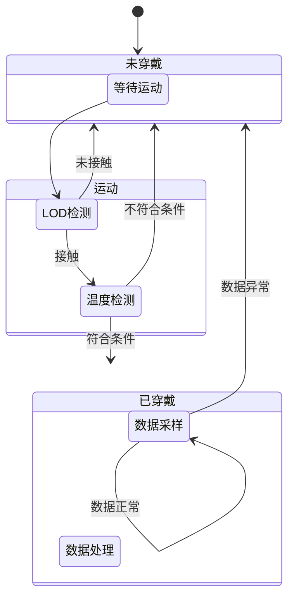

# 实验笔记

## LOD检测穿戴的原理

LOD检测疑似利用生物电，当人体碰到开发板的铜片时，LOD的连接状态就会变为各种疑似连接的状态。

经测试，**使用任何导电的物体（如铅笔头）接触该铜片都会导致连接状态改变**

## 穿戴检测设计

### 功能需求

1. 脱离和穿戴之间的状态变化要求在3秒内检测到；
2. 未穿戴时，关闭不需要工作的传感器，实现尽可能低的电流消耗；

### 设计方案

本设计方案基于以下前提：

1. 在非极限场景下，在穿戴设备时应当**会有动作**，人体**接触到传感器**；
2. 已知开发板的**IMU传感器电源无法关闭**；

穿戴检测的基本思想是：

- 脱离->穿戴：检测到动作，且检测到人体接触一段时间；
- 穿戴->脱离：检测到人体脱离一段时间；

为了实现尽可能低功耗，在休眠（脱离状态）时，我们将所有可以关闭的传感器关闭，只保留IMU传感器的加速度传感器，用于检测设备运动状态；当IMU传感器检测到设备运动时（HighG中断触发），这时候还不能直接认为设备被穿戴，否则设备动一下就会启动，误报率太高，这时我们开启ECG传感器的LOD功能，当6次采样（间隔0.5秒）中有3次采样是阳性结果时，可以认为确实有物体接触传感器，但这时候还不能认为设备被穿戴（下面会解释这一点），还需要利用温度传感器，如果是人体接触传感器，设备的温度应当会有一定的升高，所以，我们在LOD采样之前和之后各采样一次温度，如果检测到温度上升或者温度已经在一个合适的范围（人体的体表温度范围），才能最终认为设备被穿戴。

根据我们的测试以及LOD芯片的Datasheet，LOD检测疑似利用生物电，当人体碰到开发板的铜片时，LOD的连接状态就会变为各种疑似连接的状态。经测试，使用任何导电的物体（如铅笔头）接触该铜片都会导致连接状态改变。因此，简单的使用LOD并不能比较准确的检测穿戴，想象一下设备被拿到一个金属家具上，传感器刚好和金属接触了。

设备穿戴之后，系统变为工作状态，此时会开启所有需要的传感器，进行PPG采样，开始SPO2的计算等。

系统工作时，由于此时PPG传感器是开启的，且正在持续采样，因此用PPG传感器进行检测会比较好。回想一下PPG传感器的原理：利用光的反射，检测血液对光的吸收或者血管的变化；PPG传感器实际上就是一个微型的距离传感器，其采样结果是跟人体接触传感器距离强相关的，实测结果也是如此，当人体远离时，PPG采样数据会骤降到几十，而合理的采样数据应当是大几千。因此，我们在采样数据的时候，对每秒采样的数据进行一个抽样，如果连续两次抽样的数据值（间隔1秒）都比较小，即可认为设备已经被脱下。

## 系统状态机

穿戴检测以一个状态机的方式整合到系统中。

