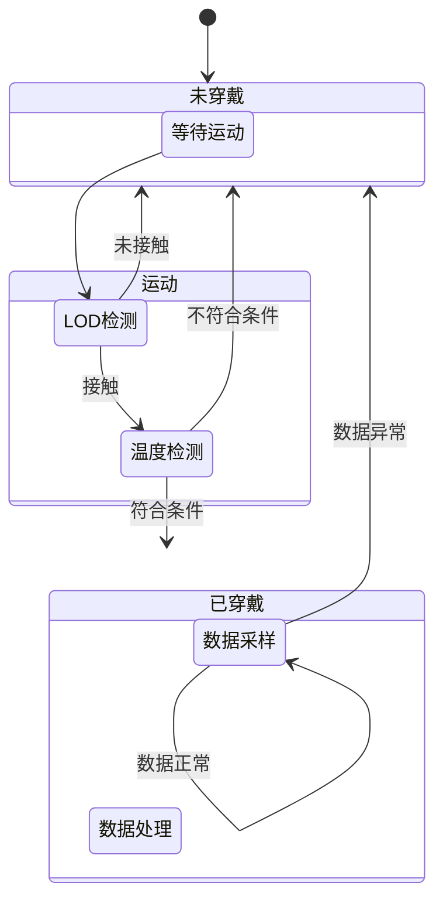
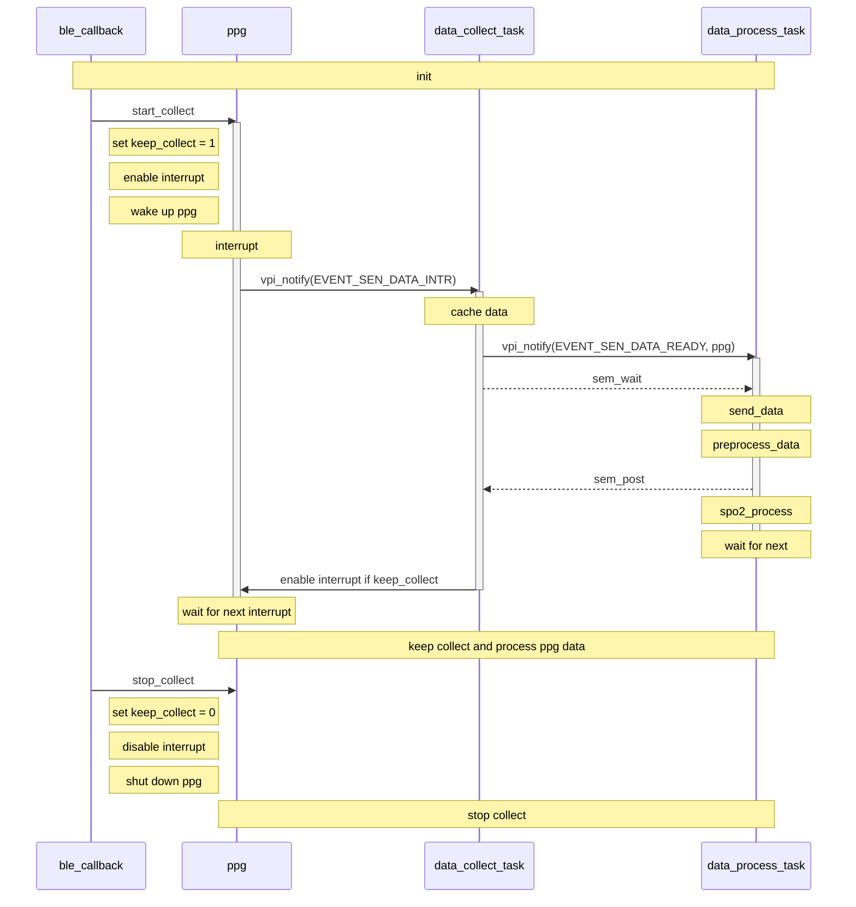

# 决赛：SPO2检测模块开发

## 一、整体方案

### 需求分析

决赛需要在初赛基础上完成以下几点要求：

1. 使用开发板提供的传感器实现穿戴检测功能。
2. 开发板采集PPG数据，实时计算SPO2和PPG错误率和丢失率。
3. 发送SPO2数据到APP端并实时显示。

### 概要设计

基于初赛已完成的内容迭代开发。

1. 使用IMU，LOD，TMP，PPG传感器检测穿戴状态；
2. 在数据收集和处理的过程中添加错误率和数据丢失率检测功能，并且定时发送结果；
3. 嵌入式端使用SDK发送数据，APP端接收数据后使用WebView+Echarts方法实时显示数据。

## 二、穿戴检测设计

### 功能需求

1. 脱离和穿戴之间的状态变化要求在3秒内检测到；
2. 未穿戴时，关闭不需要工作的传感器，实现尽可能低的电流消耗；

### 设计方案

本设计方案基于以下前提：

1. 在非极限场景下，在穿戴设备时应当**会有动作**，人体**接触到传感器**；
2. 已知开发板的**IMU传感器电源无法关闭**；

穿戴检测的基本思想是：

- 脱离->穿戴：检测到动作，且检测到人体接触一段时间；
- 穿戴->脱离：检测到人体脱离一段时间；

为了实现尽可能低功耗，在休眠（脱离状态）时，我们将所有可以关闭的传感器关闭，只保留IMU传感器的加速度传感器，用于检测设备运动状态；当IMU传感器检测到设备运动时（HighG中断触发），这时候还不能直接认为设备被穿戴，否则设备动一下就会启动，误报率太高，这时我们开启ECG传感器的LOD功能，当6次采样（间隔0.5秒）中有3次采样是阳性结果时，可以认为确实有物体接触传感器，但这时候还不能认为设备被穿戴（下面会解释这一点），还需要利用温度传感器，如果是人体接触传感器，设备的温度应当会有一定的升高，所以，我们在LOD采样之前和之后各采样一次温度，如果检测到温度上升或者温度已经在一个合适的范围（人体的体表温度范围），才能最终认为设备被穿戴。

根据我们的测试以及LOD芯片的Datasheet，LOD检测疑似利用生物电，当人体碰到开发板的铜片时，LOD的连接状态就会变为各种疑似连接的状态。经测试，使用任何导电的物体（如铅笔头）接触该铜片都会导致连接状态改变。因此，简单的使用LOD并不能比较准确的检测穿戴，想象一下设备被拿到一个金属家具上，传感器刚好和金属接触了。

设备穿戴之后，系统变为工作状态，此时会开启所有需要的传感器，进行PPG采样，开始SPO2的计算等。

系统工作时，由于此时PPG传感器是开启的，且正在持续采样，因此用PPG传感器进行检测会比较好。回想一下PPG传感器的原理：利用光的反射，检测血液对光的吸收或者血管的变化；PPG传感器实际上就是一个微型的距离传感器，其采样结果是跟人体接触传感器距离强相关的，实测结果也是如此，当人体远离时，PPG采样数据会骤降到几十，而合理的采样数据应当是大几千。因此，我们在采样数据的时候，对每秒采样的数据进行一个抽样，如果连续两次抽样的数据值（间隔1秒）都比较小，即可认为设备已经被脱下。

### 系统状态机

穿戴检测以一个状态机的方式整合到系统中。



## 三、数据采集

此次题目中，数据采集是比较重要的一部分，所有的算法都依赖于开发板采集的数据。而本次主要涉及的是PPG数据的采集，因此，我们主要关注开发板的PPG传感器。

PPG传感器的硬件初始化部分已在样例中给出，本文不再赘述，根据SDK文档的描述，我们需要初始化ppg设备，并设置工作参数，根据开发过程中的实验情况，我们将PPG传感器的参数设置为如下：

- 采样率：50hz
- 工作模式：PPG_MODE_REDIR
- LED功率参数：50
- adc范围：32768

在此参数下，PPG传感器采集的正常数据，既不至于太大以至于溢出，又不至于太小难以体现波形。

根据SDK文档，PPG传感器利用中断来通知系统读取传感器数据，为了不影响系统实时性，我们需要一个单独的任务来收集数据。此外，已知PPG内置FIFO只有0x20大小，在REDIR模式下只能保存16组数据，所以我们需要缓存从PPG传感器读到的数据，并在每次中断时sleep一段时间，让中断能够正确开启，50hz采样率下，PPG内置FIFO经过0.3秒就快满了，为了维持FIFO容量在一半左右，并考虑数据处理的时间，每次sleep 0.1秒是比较合理的。由于开发板PPG传感器的特性，每次开启时无法立马采集到数据，因此，当触发中断但无法采集到数据时，我们需要立即开启中断，值得正确采集到数据。

因此，我们的数据采集任务步骤如下：

1，创建数据采集任务；

2，注册`EVENT_SEN_DATA_INTR`事件；

3，循环监听`EVENT_SEN_DATA_INTR`事件；

这里的关键在于`EVENT_SEN_DATA_INTR`事件，在我们的系统中，只有PPG中断回调函数会触发这个事件，而且我们的PPG中断中也只做这一件事，每当PPG中断触发时，就会产生一个`EVENT_SEN_DATA_INTR`事件。

4，开启中断，唤醒PPG设备；

5，中断触发，产生`EVENT_SEN_DATA_INTR`事件；

6，数据采集任务监听到`EVENT_SEN_DATA_INTR`事件，开始读取并缓存数据,并设置数据标签；

在代码中，我们暂时缓存稍大于一秒钟的数据。考虑到数据收集任务调度比较频繁，而数据处理一秒钟只调用一次，因此我们在另一个任务中处理数据（注：数据处理任务监听`EVENT_SEN_DATA_READY`事件）。

当收集到足够的数据时，对数据进行抽样，如果连续两次抽样结果不合格，则认为设备已经被脱下，停止数据采样；如果数据采样合格，我们产生一个`EVENT_SEN_DATA_READY`事件,并将准备好数据句柄作为参数传递。由于另一个任务需要使用临时数据区的缓存的数据以及ppg，因此产生事件后不能立马继续执行后续代码，开启中断等，防止后续的中断修改临时数据区的数据，虽然后面有osal_sleep(100)，但谨慎起见，我们用一个信号量进行同步。

7，开启PPG中断，等待下一次中断触发。

数据采集的部分和初赛中的设计相差不大。**主要的区别有以下几点**：

1. 设置了定时器，每隔10秒计算数据丢失率；

   定时器开始时记录开始时间，重置采样个数；在每次从ppg读取到数据时，记录采样数据的个数和当前采样时间；当触发定时器时，用记录的最后一个采样时间减去采样开始时间得到总的采样时间，再乘以采样频率，就可以得到期望的采样个数，根据实际采样个数和期望采样个数即可算出采样丢失率；

2. 为每个数据添加了标签，用于检测数据出错；

   数据采样任务使用了一个缓冲区保存数据，每次收集到超过一秒的数据时，就会通知数据处理任务进行数据处理，然后数据采样任务会重置缓冲区指针，准备接受后续数据。在这个过程中，后续采样数据可能覆盖之前还未处理的数据。我们在每次收集数据时，一对一的设置一个标签，标签每一轮更新一次。在数据处理时，如果发现数据对应的标签与当前的标签不一致，则该数据已经被覆盖。根据实际采样的总数和错误数据的个数即可算出错误率。由于我们设置了信号量，在接收到数据预处理已完成的信号时才会重置缓冲区标签，因此实际几乎不会发送数据出错。

3. 每秒（当收集数据个数超过一秒的数据时）会对缓存的采样数据进行抽样，如果连续的抽样结果都小于特定阈值时，认为设备已被脱下，触发系统状态变更事件，停止采样和数据处理。

## 四、数据处理

对于采集到的数据，我们主要考虑发送原始数据到手机端和计算HRV并将HRV结果发送到手机端。处理数据时，需要考虑临时数据区的同步，应当尽快使用完临时数据区释放信号量，因此，我们将数据预处理部分从hrv算法中分离，一旦数据预处理完成，我们就不需要再使用临时数据区的数据，便可以提前释放信号量。

因此，我们的数据处理任务步骤如下：

1，创建数据采集任务；

2，注册`EVENT_SEN_DATA_READY`事件；

3，循环监听`EVENT_SEN_DATA_READY`事件；

4，监听到`EVENT_SEN_DATA_READY`事件，开始处理数据；

6，预处理数据；

7，释放信号量；

8，计算SPO2；

9，等待下一次`EVENT_SEN_DATA_READY`。

在这个设计中，要想正常工作，关键的一点是必需能够随时开始和停止数据采集，我们用序列图来说明。整个数据采集和数据处理的工作流程如下：



我们在数据收集任务中设置了一个全局变量keep_collect，并将keep_collect的设置与开关中断使用mutex绑定为原子操作；此外，整个流程只有一个触发路径，即：ppg中断->data_collect_task->data_process_task。因此，只要控制ppg中断开关和keep_collect就能控制整个流程的开始与结束，又因为ppg中断开关和keep_collect设置是原子事务，因此不会存在keep_collect为0中断还能被开启的情况。

## 五、SPO2算法

### 算法原理

血氧饱和度（英语：Oxygen saturation），或称血氧浓度，是指血中氧饱和血红蛋白相对于总血红蛋白（不饱和+饱和）的比例。人体需要并调节血液中氧气的非常精确和特定的平衡。 人体的正常动脉血氧饱和度为95-100％。 如果该水平低于90％，则被认为是低氧血症。

​		仪器通过使用发光二极管（红光RED，红外IR，绿光GREEN和蓝光BLUE等）照射被测部位，同时使用一个光电二极管接收透射/反射的光线，将光信号转换为电信号。然后通过高精度的ADC测量反射回的电流大小，评估血液中的含氧量。

​		一个典型的PPG波形可分两部分，即DC signal直流信号和AC signal交流信号

计算血氧饱和度需要先计算R值，公式如下：
$$
\mathrm{R}= \frac{\frac{AC_{red}}{DC_{red}}}{\frac{AC_{ired}}{DC_{ired}}}
$$


​		求出R值后可以通过查表即可得到血氧值，也可以通过美信拟合公式计算：
$$
\mathrm{SPO2} = -45.060R^2 + 30.354R + 94.845
$$
​		但是实际测试我们发现使用美信拟合的结果偏高，因此我们利用给定的数据重新利用一次和二次函数进行分段拟合，结果如下：
$$
f(R) = 
	\begin{cases}
	\mathrm-82.36R^2 + 46.451R + 93.39, & \text {if R <= 0.6}\\
	\mathrm91.611 - 50(R - 0.6), & \text {if R > 0.6}
	\end{cases}
$$

### 算法实现

SPO2血氧饱和度算法步骤: 

1. 实时逐秒读取PPG数据, 按奇偶分离出进行红光和红外数据并进行预处理；

   预处理过程沿用了之前心率算法的设计，使用51点平均去基线，11点平均滤波。

2. 保存经过预处理的红光和红外数据，以及其基线数据，用于计算直流分量DC；

3. 每秒计算一次血氧饱和度, 数据窗口采用了5秒的长度；

4. 对red和ired数据进行二次差分, 求得波峰波谷坐标；

5. 利用波峰波谷的均值差, 求得交流分量AC, 利用波谷均值加上该窗口的基线均值作为直流分量DC；

   实际实现过程中，我们使用过直接使用原始数据的波峰波谷数据计算作为AC,DC，但是出现剧烈的不稳定性，原因在于采集的ppg本身便是不稳定的，并且会出现骤变的现象，因此我们使用了两种策略进行处理：

   - 不再原始数据上求AC和DC，而是使用基线数据与去基线数据对AC和DC进行还原，这样可以保证算法的稳定性；
   - 在开发板上实测时，因为电流波动，去基线数据可能无法计算出波峰波谷，因此我们为每次的波峰数组都至少添加一个最大，同时波谷数组添加一个最小值，防止波峰波谷未找到的情况。

6. 求得红光和红外的R值, 为保证算法稳定性，采用R值衰减策略，每次利用上一个有效的R值与当前计算结果求平均作为最终有效R值，最后利用拟合函数计算血氧饱和度；

SPO2中使用的数据预处理和寻找波峰波谷方法与HRV中相似，具体代码不再赘述。

## 六、发送数据

因为决赛不要求发送原始PPG数据，所以BLE发送遵循简单原则，只定义一种自定义消息包`Spo2Msg`传输所有数据（SPO2、丢失率和错误率和穿戴状态）。因为自定义数据包无法触发`EVENT_PDU_TRANSFER_STATUS`事件，所以再定义一个自定义请求包`AckMessage`，APP端每收到一个`Spo2Msg`都返回一个`ack`，数据结构如下：

```c
typedef struct _Spo2Msg {
    uint16_t id;
    uint16_t spo2;
    uint16_t loss_rate;
    uint16_t error_rate;
    uint16_t lead_off;
} __attribute((__packed__)) Spo2Msg;

typedef struct _AckMessage{
    uint16_t flag;
    uint16_t id;
}__attribute((__packed__))AckMessage;
```

注意每一个`Spo2Msg`还含有一个`id`作为发送序号，与`AckMessage`的`id`值对应。这个值还会在动态显示数据时使用，作为每一个数据在折线图中的横坐标值。

参考手册描述的内存管理流程和自定协议，自定义以下数据结构作为发送模块的数据缓冲区：

```c
static RingBufCtrl *res_data_ctrl = NULL;
static uint8_t *res_data_buf      = NULL;

static RingBufCtrl *res_fifo_ctrl = NULL;
static uint8_t *res_fifo_buf      = NULL;
```

1. `res_data_ctrl`：SPO2数据缓冲区，使用SDK提供的环形队列。
2. `res_fifo_ctrl`：BLE数据包缓冲区，存放每一个``Spo2Msg`对应的`BleTransmitData`结构。

由于不清楚底层蓝牙的具体发送原理，即BLE的task是否只是在发送数据是才读取`BleTransmitData`，所以我们也使用一个缓冲区存储该结构。由于SDK的`Ring buffer`没有读取缓冲区中第n个数据的接口，所以每一次使用`vpi_ringbuf_peek`获得`BleTransmitData`后，都调用`vpi_ringbuf_pop`将它出队。因为`Ring buffer`出队可能只修改`wt_idx`值，只要缓冲区大小合适，数据就不会被重写。实践证明确实如此。

嵌入式端使用定时任务，在设备工作时每秒定时发送结果数据到APP；此外设备工作状态改变时也会发送数据包通知APP。

## 七、实时显示

APP端实时显示SPO2值。APP主要由一个`MainActivity`和以下四大部分组成：

1. `Fragment`：三个`Fragment`子类，与`Navigation`配合显示界面。
2. `Protocol`：请求与消息类，包括`SpO2Msg`和`AckMessage`。
3. `View`：UI相关类，负责更新视图，包括`BleDeviceViewAdapter`和`ChartAdapter`。
4. `Manager`：事务相关类，包括蓝牙管理`BleManager`和数据管理`DataManager`。

`SPO2Fragment`负责显示数据，包括一个`WebView`和三个`TextView`。`WebView`加载百度提供的[Echarts](https://echarts.apache.org/zh/index.html)来显示SPO2，剩余三个`TextView`用于显示丢失率、错误率和穿戴状态。`DataManager`负责把数据更新到`SPO2Fragment`中。

APP在收到`Spo2Msg`后，会调用`DataManager#getData`解析数据，并把数据保存在一个`LinkedList`中。`DataManager`的字段如下：

```java
    MainActivity activity;
    public LinkedList<SpO2Msg> spO2Buffer; //存储数据的结构
```

每一次加载`SPO2Fragment`都会先调用`ChartAdapter#parseInitString`接口，将`spO2Buffer`转换成`JsonArray`，并通过`Gson#toJson`返回对应的字符串。

```java
    Gson gson;
    JsonArray jsonArray;

	public String parseInitString(LinkedList<SpO2Msg> resMsgs){
        Type type=new TypeToken<LinkedHashMap<Integer,Integer>>(){}.getType();
        for (SpO2Msg item : resMsgs) {
            int id=item.trans_id;
            int value=item.spo2;
            JsonArray array=new JsonArray();
            array.add(id);
            array.add(value);
            jsonArray.add(array);
        }
        return gson.toJson(jsonArray);
```

然后调用`WebView#loadUrl`执行定义的JavaScript的`init`函数显示已经收到的数据。参数`s`就是前面获得的字符串。

```javascript
var data = [];

function init(s) {
	data = JSON.parse(s);
	option = {
		series: [
			{
				data: data
			}
		]
	}
	chart.setOption(option);
}
```

`DataManager#getData`会调用`ChartAdapter#parseToString`，该接口功能与`ChartAdapter#parseInitString`类似，返回新增数据对应的字符串。

```java
    public String parseToString(int id, int value) {
        int[] newData=new int[2];
        newData[0]=id;
        newData[1]=value;
        return gson.toJson(newData);
    }
```

然后调用`WebView#loadUrl`执行定义的JavaScript的`addData`函数增加数据。

```javascript
function addData(s) {
    
		var newdata = JSON.parse(s);
		data.push(newdata);
		option = {
			series: [
				{
						data: data
				}
				]
			}
		chart.setOption(option);

		if (data.length >= 10) {
			option = {
				dataZoom: [
					{
						startValue: data[data.length-1][0] - 10,
						endValue: data[data.length-1][0]
					}

				]
			}
			chart.setOption(option);
		}
	}
```


